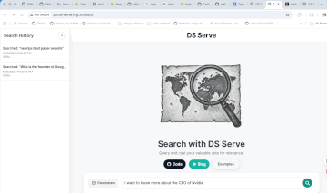

<div align="center">
  
  <h1>🚀 DS SERVE: A Framework for Efficient and Scalable Neural Retrieval</h1>
  <p>
    <a href="https://github.com/berkeleyljj">Jinjian Liu</a><sup>1*</sup>, 
    <a href="https://yichuan-w.github.io/">Yichuan Wang</a><sup>1*</sup>, 
    <a href="https://alrope123.github.io/">Xinxi Lyu</a><sup>2</sup>, 
    <a href="https://rulinshao.github.io/">Rulin Shao</a><sup>3</sup>,<br/>
    <a href="https://joeygonzalez.com/">Joseph E. Gonzalez</a><sup>1</sup>, 
    <a href="https://people.eecs.berkeley.edu/~matei/">Matei Zaharia</a><sup>1</sup>, 
    <a href="https://www.sewonmin.com/">Sewon Min</a><sup>1</sup>
  </p>
  <p>
    <sup>1</sup>University of California, Berkeley &nbsp;
    <sup>2</sup>University of Illinois Urbana–Champaign &nbsp;
    <sup>3</sup>University of Washington
  </p>
  <p><sup>*</sup>Equal contribution.</p>
  <p>
    [<a href="http://api.ds-serve.org:30888/ui">Web Interface</a>] 
    [<a href="docs/API_DOCUMENTATION.md">API Endpoint</a>] 
    [<a href="docs/VOTES_DOCUMENTATION.html">Voting System</a>] 
    [<a href="docs/assets/DS_SERVE_Camera_Ready.pdf">Paper</a>]
  </p>
</div>

---

> 1. You can turn any large in-house dataset (<1T tokens) into a **high-throughput (up to 10000 index-only QPS)**, **memory-efficient (<200 GB RAM)** retrieval system with a **web UI and API**.
> 2. Our **prototype**, built on **400B words** of high-quality LLM pre-training data, is readily available and provides downstream gains comparable to commercial search engine endpoints.

<p align="center">
  
  
</p>
<p align="center"><b>DS-Serve UI & control panel</b></p>

## Introduction

This repository contains the DS-Serve Public API and server code. It exposes a production‑ready Flask service for retrieval‑augmented generation (RAG) backed by a billion‑scale FAISS IVFPQ index or DiskANN. The server provides adjustable settings and search modes at low-latency. A small CLI helps download/prepare indices and start the server.

### Expected data layout (under DATASTORE_PATH)

```
<DATASTORE_PATH>/
  <domain_name>/
    config.json              # loader config (encoder, nprobe, index filename, etc.)
    index/                   # a single merged FAISS file (*.faiss)
    passages/                # *.jsonl shards for text lookup
```

## Quickstart (IVFPQ / Standard Setup)

### Datasets
- [CompactDS-102GB](https://huggingface.co/datasets/alrope/CompactDS-102GB)
  - Core index and passages. Please refer to the dataset card for details.
- [Full embeddings](https://huggingface.co/datasets/alrope/cpds_embeddings/tree/main)
  - PubMed embeddings are sharded, so combine locally if needed:
```bash
cat massiveds-pubmed--passages7_00.pkl_{aa,ab,ac,ad,ae,af,ag,ah,ai} \
  > massiveds-pubmed--passages7_00.pkl
```

### 0) Prepare the repo

```bash
git clone https://github.com/Berkeley-Large-RAG/RAG-DS-Serve.git 
cd RAG-DS-Serve
git submodule update --init --recursive
```

### 1) Download the dataset/index from Hugging Face

- Choose a local data root (DATASTORE_PATH). Example:
```bash
export DATASTORE_PATH=/home/ubuntu/massive-serve-dev
```

- Download the dataset into `$DATASTORE_PATH/<domain_name>` (example uses `index_dev`):
```bash
huggingface-cli download <ORG_OR_USER>/<DATASET_REPO> \
  --repo-type dataset \
  --local-dir $DATASTORE_PATH/index_dev
```

Notes:
- The directory should include an `index/` directory with a IVFPQ (FAISS) index and a `passages/` directory with `.jsonl` files.
- If your index is uploaded in split/chunked form, see Step 3 to combine shards.

### 2) Build the position mapping arrays 

The server looks up passage text by the IVFPQ index id using position mapping arrays. Generate them once from your `passages/` directory:

- Open `utils/build_arr.py` and set `INPUT_DIR` to your passages folder, e.g.:
```python
INPUT_DIR = "/home/ubuntu/massive-serve-dev/index_dev/passages"
```

- Then run from the repo root:
```bash
python utils/build_arr.py
```

This writes three files next to the script (and the server expects them under `index_dev/` as configured by the code):
- `index_dev/position_array.npy`
- `index_dev/filename_index_array.npy`
- `index_dev/filename_list.npy`

### 3) Combine IVFPQ index shards

Your `index/` folder contains split parts, combine them into a single `.faiss` file before serving.

- Simple shard set (concatenate all `...faiss_**` parts in order; do NOT include the `.meta` file):
```bash
cd $DATASTORE_PATH/index_dev/index
# Example names: index_IVFPQ.100000000.768.65536.64.faiss_aa, ..._ab, ..._ac, ...
cat $(ls index_IVFPQ.100000000.768.65536.64.faiss_* | sort) > index_full.faiss
```

After combining, ensure there is exactly one `.faiss` file in `index/` (e.g., `index/index_full.faiss`).

### 4) Launch the API server

Use `index_dev` as the domain name (provided by `index_dev/config.json`):
```bash
DATASTORE_PATH=/home/ubuntu/massive-serve-dev \
python -m massive_serve.cli serve --domain_name index_dev
```

By default the server starts at port `30888` and exposes `/search` and `/vote` endpoints.

### 5) Test the API
For the full reference and examples, see `docs/API_DOCUMENTATION.md`. You can use curl commands documented there to run quick tests. 


## DiskANN Build 
**NOTE: The pre-built DiskANN index will be released publicly soon. The instructions below are currently intended for technical reference or internal testing.** \
For convenience when testing from this repo root, you can point to the local copies under `./`:
- `./position_array.npy`
- `./filename_index_array.npy`
- `./filename_list.npy`
- `./data/passages/`
- `./DiskANN-build/DiskANN_index/`

## DiskANN Serving (Setup and Launch)

### 1) Create environment

```bash
# Using uv
uv venv .venv
source .venv/bin/activate
uv pip install -U pip setuptools wheel
# Install project dependencies
uv pip install -r requirements.txt
uv pip install -e .
# Install DiskANN
uv pip install --no-deps diskannpy==0.7.0
```

### 2) Launch the server (DiskANN)

From the repo root:
```bash
DATASTORE_PATH=$(pwd)
# Set your DiskANN index prefix here (e.g., diskann_mips_f32_R60_L80_B200_M500)
DISKANN_PREFIX="<YOUR_INDEX_PREFIX>" 

mkdir -p "$DATASTORE_PATH/logging"

DS_SERVE_LOG_DIR="$DATASTORE_PATH/logging" \
MASSIVE_SERVE_PORT=30888 \
MS_BACKEND=diskann \
DATASTORE_PATH="$DATASTORE_PATH" \
DISKANN_INDEX_DIR="$DATASTORE_PATH/DiskANN-build/DiskANN_index" \
DISKANN_INDEX_PREFIX="$DISKANN_PREFIX" \
DISKANN_DISTANCE=mips \
DISKANN_NUM_THREADS=128 \
DISKANN_NODES_TO_CACHE=100000 \
DISKANN_L=500 \
DISKANN_W=4 \
DISKANN_WARMUP=1 \
DISKANN_WARMUP_QUERIES=5000 \
DISKANN_WARMUP_BATCH=256 \
DISKANN_WARMUP_QUERY_FILE="$DISKANN_INDEX_DIR/${DISKANN_PREFIX}_sample_data.bin" \
DISKANN_WARMUP_KEEPALIVE=1 \
python -m massive_serve.cli serve --domain_name data
```

Tips:
- Use a different `MASSIVE_SERVE_PORT` if firewall issues occur or one is already in use.
- `DISKANN_NUM_THREADS` sets CPU threads for DiskANN search; 0 uses all logical CPUs.
- `DISKANN_NODES_TO_CACHE` pins popular nodes in RAM; warmup further primes OS page cache.

### Enabling Exact Search (Optional)

"Exact Search" re-scores top candidates using a heavy encoder (GritLM) for higher accuracy but requires a GPU. To enable it:

1. Open `massive_serve/api/backup.html`.
2. Uncomment the "Exact Search" toggle block (search for "Exact Search").
3. Uncomment the help text entry in the JavaScript `HELP_CONTENT` object.
4. Ensure your server has GPU access (the backend automatically detects and uses it).
